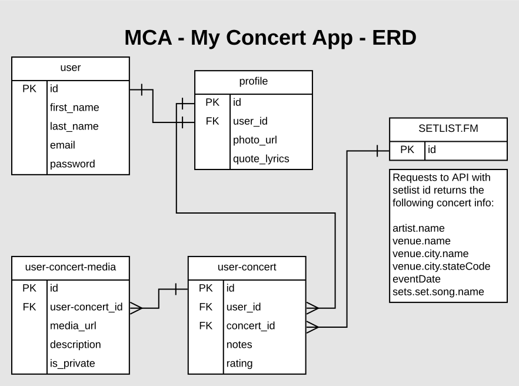

# MCA - My Concert App
MCA - My Concert App was developed for concert-goers to quickly find concerts they've attended and add them to their account so they can easily view all of their shows, while adding the extra functionality to rate shows, add notes, and upload photos to personalize their experience.

## Technologies Used
MCA was written in Python with the Django framework.

MCA was developed using VSCode, AdobeXD, GitHub, SQLite, DB Browser, and Postman

## Instructions for Installing MCA
1. Navigate to the directory in which you want MCA to reside
1. run `git clone git@github.com:BryanNilsen/MCA-MyConcertApp.git`
1. run `cd MCA-MyConcertApp`
1. run `virtualenv env` to create a virtual environment within that directory
1. run `source env/bin/activate` to initialize a virtual environment (run `deactivate` to exit environment)
1. run `pip install -r requirements.txt`

## Secret Keys

The settings.py file contains some sensitive information that should not be publicly shared. This information has been omitted from this repository. To work with MCA locally, you will need to generate or apply for the following keys:

- `SECRET_KEY`
Django generates a secret key used for cryptographic signing. More info [here](https://docs.djangoproject.com/en/2.1/ref/settings/#secret-key)

1. You can generate a new SECRET_KEY [here](https://djskgen.herokuapp.com/)
1. Paste your new secret key into the .env_template file in place of `<your secret key goes here>`
1. Save the file

- `SETLIST_FM_API_KEY`

To access the Setlist.fm API, you will need to obtain your own private API key.
1. Register for an account [here](https://www.setlist.fm/signup)
1. Apply for an API key [here](https://www.setlist.fm/settings/api)
1. Paste your new API key in the .env_template file in place of `<your setlist fm api key goes here>`
1. Save the file

Once you've updated both the Secret Key and API key, there's two more final steps:
1. Open the .env_template file to ensure both the Secret Key and API key have your new keys
1. Rename the .env_template file to .env by removing the `_template`

CONGRATULATIONS!! You are ready to begin working with the MCA App!

## MCA ERD - Entity Relationship Diagram

## Thanks:
NSS Instructors: Joe Shepherd, Kimmy Bird, Brenda Long

Login/Registration Functionality Boilerplate Code provided by Joe Shepherd and Steve Brownlee

[Cohort 28](https://nss-day-cohort-28.github.io/Class-Website/)