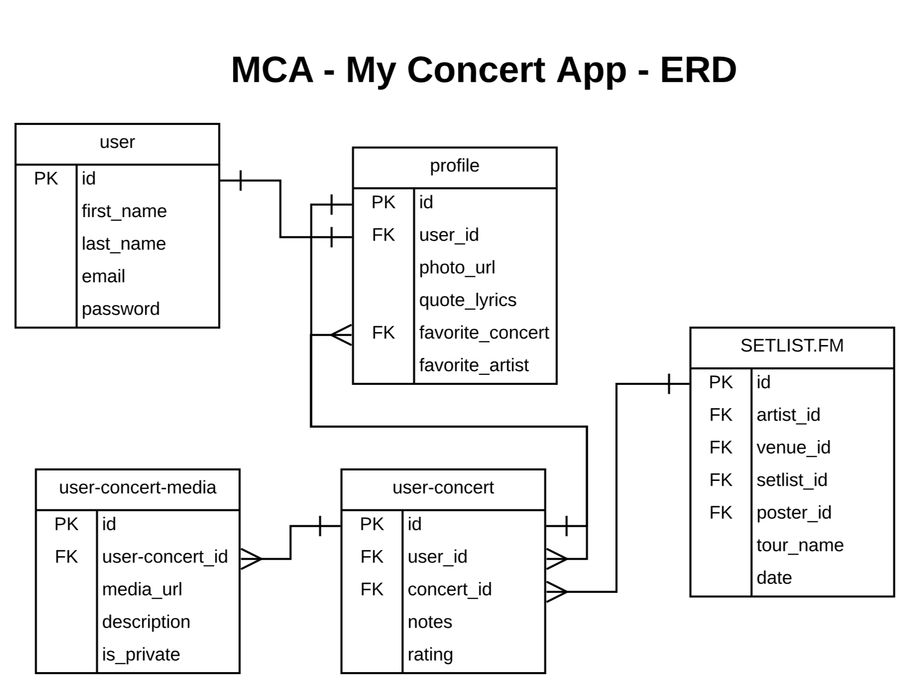

# MCA - My Concert App
This web application is the source code for My Concert App. It is written in Python with the Django framework.

## MCA ERD:

Resources used in the development of this application:
DB Browser
Postman - api queries

## Functionality:
User registration (forked from Steve and Joe)
User login (forked from Steve and Joe)
Edit Profile
User logout (forked from Steve and Joe)
Search Concerts - using the setlist.fm api
Add Concert
Edit Concert
Add/Remove Photos
Delete Concert

Certain private keys are include in the functionality of this app.
duplicate the env_template file, add your custom info, and delete the _template

Thanks:
Cohort 28
Joe Shepherd, Kimmy Bird, Brenda Long

Toptal.com - lined paper background
https://www.toptal.com/designers/subtlepatterns/lined-paper-2/
Google Fonts - marker font for setlist
https://fonts.google.com/specimen/Permanent+Marker