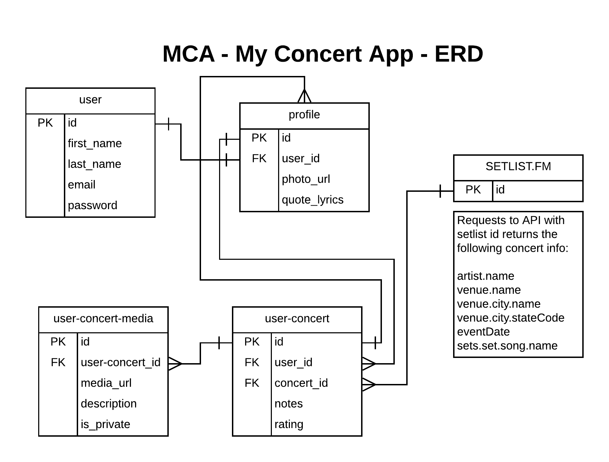

# MCA - My Concert App
MCA - My Concert App was developed for concert-goers to quickly find, add, and view all of the shows they attend, while adding the extra functionality to rate shows, add notes, and upload photos to personalize the experience.


## Technologies Used
MCA was written in Python with the Django framework.


MCA was developed using VSCode, AdobeXD, GitHub and the Setlist.fm API


## Instructions for Installing MCA
* Navigate to the directory in which you want MCA to reside
* run `git clone git@github.com:BryanNilsen/MCA-MyConcertApp.git`
* run `cd MCA-MyConcertApp`
* run `virtualenv env` to create a virtual environment within that directory
* run `source env/bin/activate` to initialize a virtual environment (run `deactivate` to exit environment)
* run `pip install -r requirements.txt`


## MCA ERD:



Resources used in the development of this application:
DB Browser
Postman - api queries

```pip install -r requirements.txt```

## Functionality:
User registration (forked from Steve and Joe)
User login (forked from Steve and Joe)
Edit Profile
User logout (forked from Steve and Joe)
Search Concerts - using the setlist.fm api
Add Concert
Edit Concert
Add/Remove Photos
Delete Concert


Certain private keys are include in the functionality of this app.
duplicate the env_template file, add your custom info, and delete the _template


Thanks:
Cohort 28
Joe Shepherd, Kimmy Bird, Brenda Long

Toptal.com - lined paper background
https://www.toptal.com/designers/subtlepatterns/lined-paper-2/
Google Fonts - marker font for setlist
https://fonts.google.com/specimen/Permanent+Marker